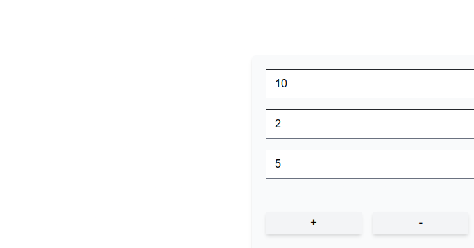
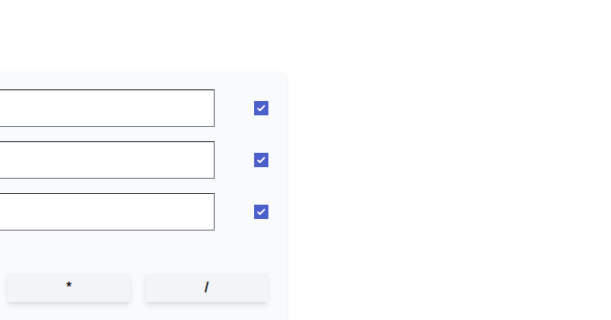
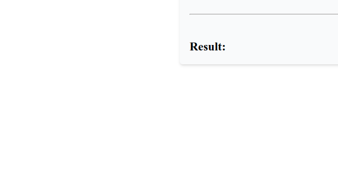
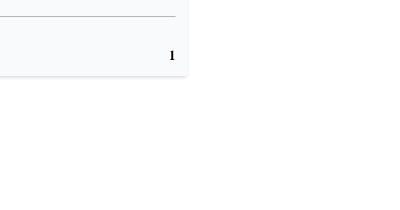

# React Calculator App

Simple calculator web app built with React. The app lets users enter up to three numeric inputs, choose which inputs are active with checkboxes, and run arithmetic operations using the `+`, `-`, `*`, and `/` buttons.

## Features

- Input up to 3 values.
- Select active values using checkboxes.
- Perform addition, subtraction, multiplication, and division.
- Show the calculation result instantly in the UI.
- Validate text input so only numbers are accepted.

## App Overview

This project is a frontend-only React application. All logic runs in the browser and state is managed locally inside the main `App` component.

Current application flow:

1. Users type numbers into the input fields.
2. Users choose which inputs are included by checking the related checkboxes.
3. Users click one of the operator buttons.
4. The app filters checked inputs, converts them to numbers, calculates the result, and renders the result section.

## Architecture

The application uses a simple component-based architecture:

- `App` is the container component and holds the main state and business logic.
- `Input` is a reusable presentational component for text input plus checkbox input.
- `Operator` is a reusable button component for calculator operations.
- `Result` is a presentational component that displays the final output.

State management in `App`:

- `inputText`: stores text values for each input field.
- `inputCheckbox`: stores checkbox selection state.
- `result`: stores the latest calculation result.
- `error`: declared in the code, but not currently used by the UI.

## Folder And File Structure

```text
react-calculator-app/
|-- public/
|   |-- favicon.ico
|   |-- index.html
|   |-- logo192.png
|   |-- logo512.png
|   |-- manifest.json
|   `-- robots.txt
|-- src/
|   |-- components/
|   |   |-- Input/
|   |   |   |-- Input.js
|   |   |   `-- Input.css
|   |   |-- Operator/
|   |   |   |-- Operator.js
|   |   |   `-- Operator.css
|   |   `-- Result/
|   |       |-- Result.js
|   |       `-- Result.css
|   |-- docs/
|   |   `-- images/
|   |       |-- split_1_1.png
|   |       |-- split_1_2.png
|   |       |-- split_2_1.png
|   |       `-- split_2_2.png
|   |-- App.js
|   |-- App.css
|   |-- index.js
|   `-- index.css
|-- package.json
|-- yarn.lock
`-- README.md
```

## File Responsibilities

- `src/index.js`: application entry point that mounts React into the DOM.
- `src/App.js`: main container for state, event handlers, and calculator logic.
- `src/App.css`: layout styling for the main page.
- `src/components/Input/Input.js`: reusable input row component.
- `src/components/Input/Input.css`: styling for text input and checkbox.
- `src/components/Operator/Operator.js`: operator button component.
- `src/components/Operator/Operator.css`: operator button styling.
- `src/components/Result/Result.js`: component for showing calculation results.
- `src/components/Result/Result.css`: result section styling.
- `src/index.css`: global reset styles.
- `src/docs/images/*`: UI screenshots used in the README.

## File Naming Convention

This project currently follows these naming patterns:

- React components use `PascalCase` file names, such as `App.js`, `Input.js`, `Operator.js`, and `Result.js`.
- Component folders use the same `PascalCase` name as the component, such as `Input/`, `Operator/`, and `Result/`.
- CSS files use the same base name as the related component, such as `Input.css` and `Result.css`.
- Entry and global files use common React naming, such as `index.js` and `index.css`.

## API Explanation

There is no backend API integrated in this repository.

- No REST API calls are implemented.
- No GraphQL client is implemented.
- No external data fetching library is used.
- All calculator logic runs locally in the browser.

If an API is planned later, a good next step would be to add a dedicated service layer, for example:

- `src/services/`
- `src/api/`

That would help separate UI logic from network logic.

## Database Schema Explanation

There is no database in the current project.

- No SQL schema is defined.
- No NoSQL collections are defined.
- No ORM or database client is installed.
- No persistence layer exists yet.

Because this is a frontend-only calculator app, all data is temporary and stored only in React state while the page is open.

## Technology Stack

- React 17
- React DOM 17
- Create React App via `react-scripts` 4
- JavaScript
- CSS
- Yarn as the package manager based on the existing lockfile

## Libraries Used

Dependencies listed in `package.json`:

- `react`: UI library for building components.
- `react-dom`: renders React components to the browser DOM.
- `react-scripts`: build and development tooling from Create React App.

## Setup Project

### Prerequisites

- Node.js installed
- Yarn installed

### Install Dependencies

```bash
yarn install
```

## How To Run The App

Start the development server:

```bash
yarn start
```

After the server starts, open:

```text
http://localhost:3000
```

## Build For Production

Create a production build:

```bash
yarn build
```

The output will be generated in the `build/` directory.

## How To Test The App

Automated testing is not configured yet in this repository.

Current condition:

- There is no `test` script in `package.json`.
- There are no test files such as `*.test.js`.
- Libraries such as React Testing Library or Jest are not configured directly in this project.

For now, testing is manual:

1. Run the app with `yarn start`.
2. Open the browser.
3. Enter numeric values into the input fields.
4. Check at least two checkboxes.
5. Click an operator button.
6. Confirm the result is shown correctly.
7. Try entering non-numeric text and confirm validation appears.

If you want to add automated testing later, recommended options are:

- Jest
- React Testing Library

## Design Gallery

<p align="center">
  
  <br>
  
  
</p>

## Notes

- The current validation only allows numeric characters.
- The app requires at least two checked inputs before performing an operation.
- The message shown in the app says `Maximum of 2 inputs`, but the current logic actually checks that at least two inputs are selected before calculation.
